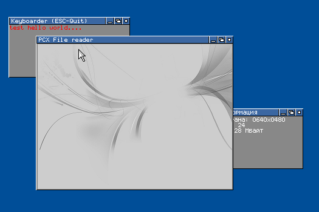

# XenonOS-16

[Run it in your browser](https://copy.sh/v86/?profile=custom&fda.url=https://raw.b00bl1k.ru/xenon004.img&fda.size=1474560)

16-битная  многозадачная операционная система, работающая в реальном режиме
процессора. В данной версии ОС реализовано чтение файлов с floppy-диска (формат
имени - 8.3), запуск программ (формат исплоняемого файла - COM), менеджер памяти,
возможность обращаться за пределы 1-ого мегабайта оперативной памяти, используя
регистр gs. XenonOS имеет GUI, зашитый в ядро, для запуска ОС нужна версия VESA
не менее 2.0.

# Build

    cd boot
    fasm x_boot.asm x_boot.bin
    cd ../kernel
    fasm kernel.asm kernel.bin

02.06.2008
